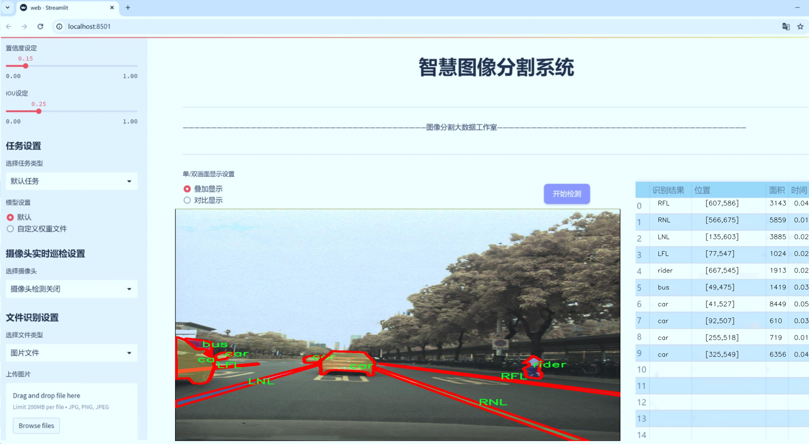
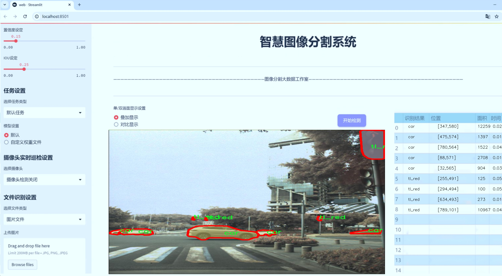
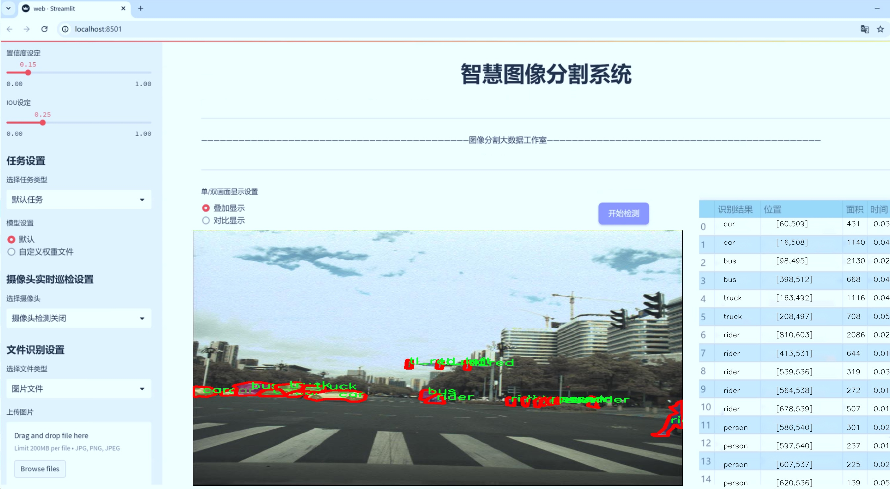
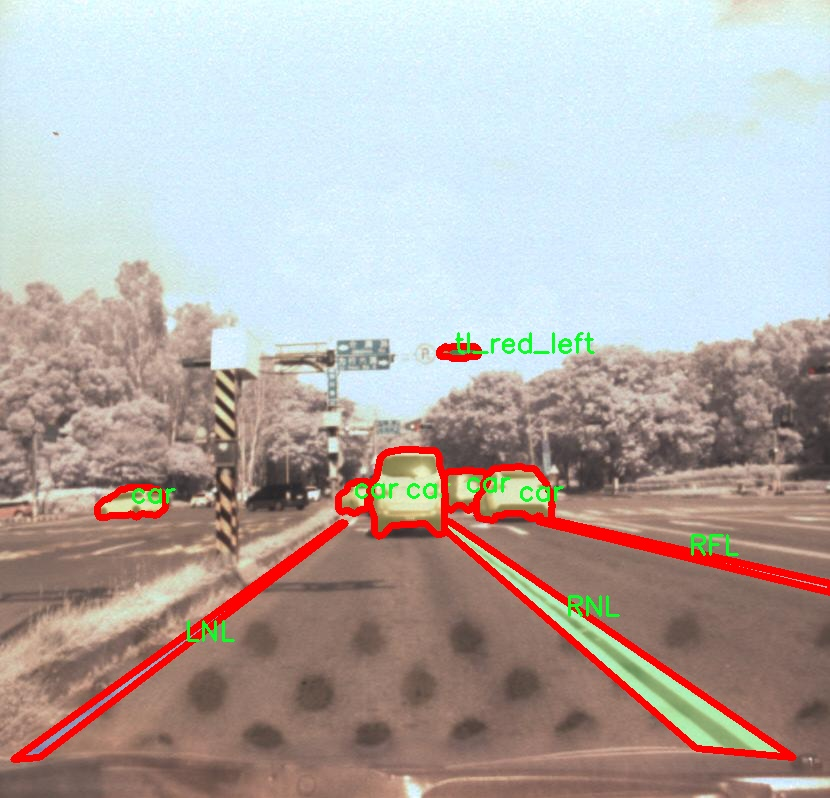
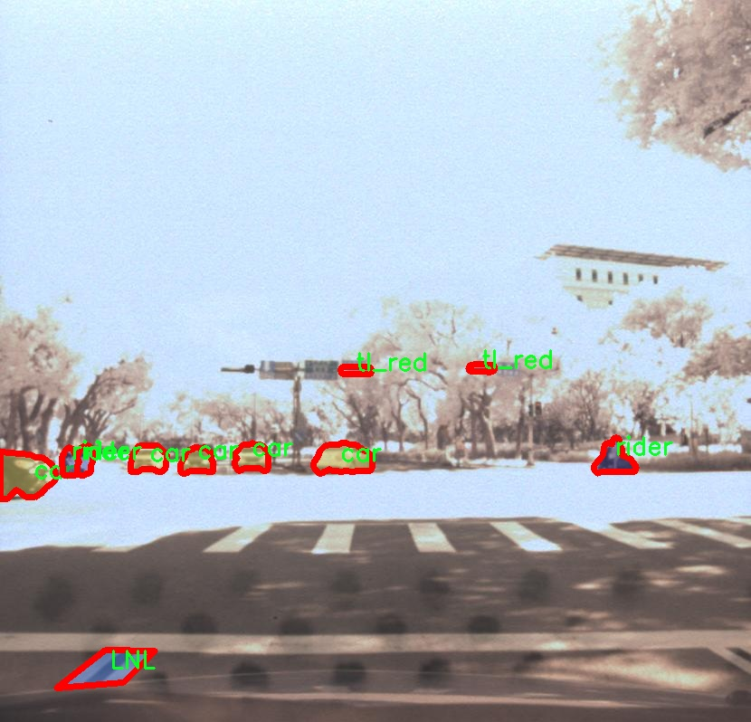
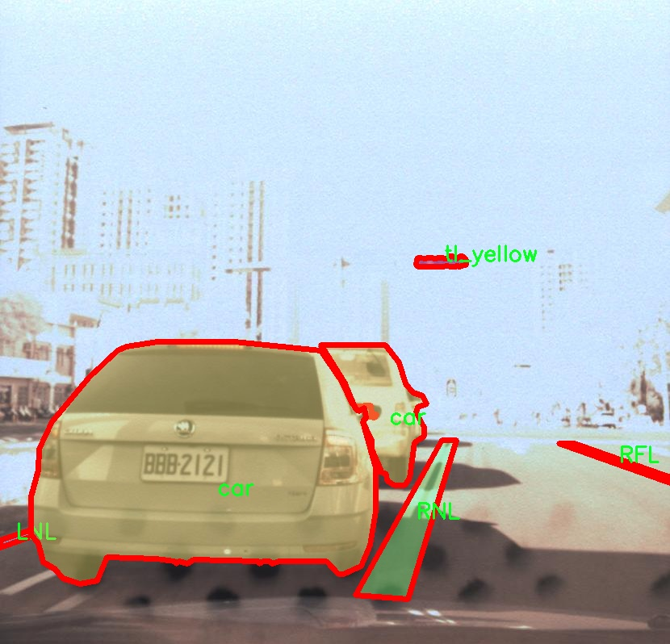
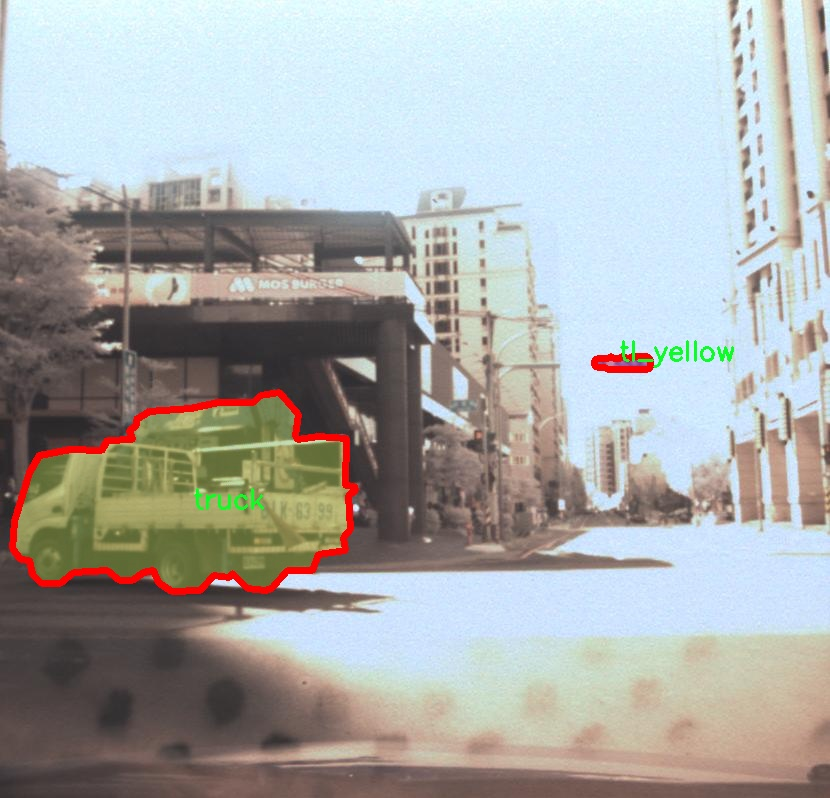
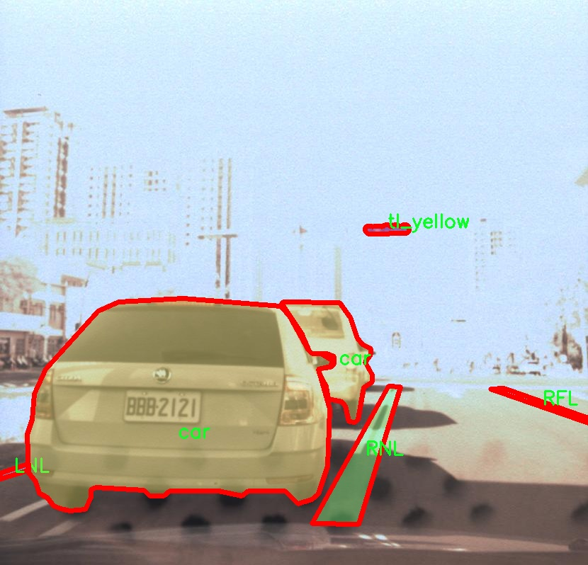

# 交通场景图像分割系统： yolov8-seg-bifpn

### 1.研究背景与意义

[参考博客](https://gitee.com/YOLOv8_YOLOv11_Segmentation_Studio/projects)

[博客来源](https://kdocs.cn/l/cszuIiCKVNis)

研究背景与意义

随着城市化进程的加快，交通管理面临着日益严峻的挑战。交通事故频发、交通拥堵、环境污染等问题不仅影响了人们的出行体验，也对城市的可持续发展构成了威胁。因此，如何有效地监测和管理交通场景，成为了智能交通系统研究的一个重要方向。近年来，计算机视觉技术的快速发展为交通场景的分析提供了新的解决方案，尤其是图像分割技术的进步，使得对交通场景中各类目标的识别与分析变得更加精确和高效。

在众多图像分割算法中，YOLO（You Only Look Once）系列模型因其高效的实时性和准确性而备受关注。YOLOv8作为该系列的最新版本，结合了深度学习的优势，能够在复杂的交通场景中实现高效的目标检测与分割。然而，尽管YOLOv8在多种场景下表现出色，但在特定的交通场景中，仍然存在一些不足之处，例如对小目标的检测能力不足、对复杂背景的适应性不强等。因此，基于改进YOLOv8的交通场景图像分割系统的研究具有重要的现实意义。

本研究将使用包含2100张图像的1115-dataset数据集，该数据集涵盖了16个类别，包括交通信号灯、汽车、行人等多种交通元素。这些类别的多样性为交通场景的全面分析提供了基础。通过对这些图像进行实例分割，可以实现对交通场景中各类目标的精确定位与识别，为后续的交通管理和智能决策提供数据支持。特别是在自动驾驶、智能交通监控等领域，准确的图像分割技术将极大地提升系统的安全性和可靠性。

此外，改进YOLOv8的研究不仅限于算法本身的优化，还包括如何有效地处理数据集中的不平衡问题、如何提高模型对不同交通场景的适应能力等。这些问题的解决将推动交通场景图像分割技术的进一步发展，并为实际应用提供理论支持和技术保障。

综上所述，基于改进YOLOv8的交通场景图像分割系统的研究，不仅能够提升交通场景中目标检测与分割的精度和效率，还将为智能交通系统的建设提供重要的技术支持。通过对交通场景的深入分析与研究，能够为交通管理者提供更为科学的决策依据，从而有效缓解交通问题，提升城市交通的整体运行效率，促进城市的可持续发展。因此，本研究具有重要的学术价值和现实意义。

### 2.图片演示







注意：本项目提供完整的训练源码数据集和训练教程,由于此博客编辑较早,暂不提供权重文件（best.pt）,需要按照6.训练教程进行训练后实现上图效果。

### 3.视频演示

[3.1 视频演示](https://www.bilibili.com/video/BV1tzUHYiEEx/)

### 4.数据集信息

##### 4.1 数据集类别数＆类别名

nc: 16
names: ['LFL', 'LNL', 'RFL', 'RNL', 'bus', 'car', 'motor', 'person', 'rider', 'tl_green', 'tl_none', 'tl_red', 'tl_red_left', 'tl_red_right', 'tl_yellow', 'truck']


##### 4.2 数据集信息简介

数据集信息展示

在本研究中，我们采用了名为“1115-dataset”的数据集，以支持改进YOLOv8-seg的交通场景图像分割系统的训练与验证。该数据集专注于交通场景的多样性和复杂性，涵盖了多种交通参与者和信号类型，旨在提高模型在实际应用中的表现和鲁棒性。数据集包含16个类别，具体类别包括：左前方车道（LFL）、左后方车道（LNL）、右前方车道（RFL）、右后方车道（RNL）、公交车（bus）、小汽车（car）、摩托车（motor）、行人（person）、骑行者（rider）、绿灯（tl_green）、无信号（tl_none）、红灯（tl_red）、左转红灯（tl_red_left）、右转红灯（tl_red_right）、黄灯（tl_yellow）以及卡车（truck）。

在数据集的构建过程中，特别注重了交通场景的多样性与复杂性，以确保模型能够在不同的环境条件下进行有效的图像分割。数据集中的图像来源于多个城市的交通监控摄像头，涵盖了不同的天气条件、时间段以及交通流量情况。这种多样性不仅有助于提高模型的泛化能力，还能使其在实际应用中更具适应性。

每个类别的图像均经过精心标注，确保每个交通参与者和信号的边界清晰可辨。这种精确的标注对于训练深度学习模型至关重要，因为它直接影响到模型学习的效果和最终的分割精度。例如，行人和骑行者的标注不仅要考虑到他们的外形特征，还需关注他们在交通场景中的相对位置，以便模型能够准确识别并分割出这些类别。

此外，数据集中还包含了丰富的场景变化，例如不同的道路类型（城市道路、高速公路等）、不同的交通信号灯状态（红灯、绿灯、黄灯等），以及各种交通工具的动态表现。这些因素共同构成了一个复杂的交通环境，使得模型在训练过程中能够学习到更为丰富的特征和模式，从而提升其在实际应用中的表现。

在数据集的使用过程中，我们将采用数据增强技术，以进一步提升模型的鲁棒性和泛化能力。通过对图像进行旋转、缩放、裁剪、亮度调整等操作，可以有效增加训练样本的多样性，帮助模型更好地适应不同的交通场景。

综上所述，“1115-dataset”不仅为改进YOLOv8-seg的交通场景图像分割系统提供了丰富的训练数据，还通过精确的标注和多样的场景设置，为模型的学习提供了坚实的基础。通过对该数据集的深入分析与应用，我们期望能够显著提升交通场景图像分割的准确性和效率，为智能交通系统的发展贡献力量。











### 5.项目依赖环境部署教程（零基础手把手教学）

[5.1 环境部署教程链接（零基础手把手教学）](https://www.bilibili.com/video/BV1jG4Ve4E9t/?vd_source=bc9aec86d164b67a7004b996143742dc)


[5.2 安装Python虚拟环境创建和依赖库安装视频教程链接（零基础手把手教学）](https://www.bilibili.com/video/BV1nA4VeYEze/?vd_source=bc9aec86d164b67a7004b996143742dc)

### 6.手把手YOLOV8-seg训练视频教程（零基础手把手教学）

[6.1 手把手YOLOV8-seg训练视频教程（零基础小白有手就能学会）](https://www.bilibili.com/video/BV1cA4VeYETe/?vd_source=bc9aec86d164b67a7004b996143742dc)


按照上面的训练视频教程链接加载项目提供的数据集，运行train.py即可开始训练



     Epoch   gpu_mem       box       obj       cls    labels  img_size
     1/200     0G   0.01576   0.01955  0.007536        22      1280: 100%|██████████| 849/849 [14:42<00:00,  1.04s/it]
               Class     Images     Labels          P          R     mAP@.5 mAP@.5:.95: 100%|██████████| 213/213 [01:14<00:00,  2.87it/s]
                 all       3395      17314      0.994      0.957      0.0957      0.0843

     Epoch   gpu_mem       box       obj       cls    labels  img_size
     2/200     0G   0.01578   0.01923  0.007006        22      1280: 100%|██████████| 849/849 [14:44<00:00,  1.04s/it]
               Class     Images     Labels          P          R     mAP@.5 mAP@.5:.95: 100%|██████████| 213/213 [01:12<00:00,  2.95it/s]
                 all       3395      17314      0.996      0.956      0.0957      0.0845

     Epoch   gpu_mem       box       obj       cls    labels  img_size
     3/200     0G   0.01561    0.0191  0.006895        27      1280: 100%|██████████| 849/849 [10:56<00:00,  1.29it/s]
               Class     Images     Labels          P          R     mAP@.5 mAP@.5:.95: 100%|███████   | 187/213 [00:52<00:00,  4.04it/s]
                 all       3395      17314      0.996      0.957      0.0957      0.0845


### 7.50+种全套YOLOV8-seg创新点加载调参实验视频教程（一键加载写好的改进模型的配置文件）

[7.1 50+种全套YOLOV8-seg创新点加载调参实验视频教程（一键加载写好的改进模型的配置文件）](https://www.bilibili.com/video/BV1Hw4VePEXv/?vd_source=bc9aec86d164b67a7004b996143742dc)

### YOLOV8-seg算法简介

原始YOLOV8-seg算法原理

YOLOv8-seg算法是YOLO系列中的一项重要进展，旨在为目标检测和分割任务提供高效且精确的解决方案。该算法在YOLOv7的基础上进行了优化，采用了更深的卷积神经网络结构，并结合了多种新技术，以提高检测和分割的性能。YOLOv8-seg不仅可以处理常规的目标检测任务，还能在像素级别上进行目标分割，这使得它在复杂场景下的应用更加广泛，如智能监控、自动驾驶、医学影像分析等。

YOLOv8-seg的核心在于其网络结构的设计。该算法分为输入端、主干网络、Neck端和输出端四个主要模块。输入端负责对输入图像进行预处理，包括Mosaic数据增强、自适应图片缩放和灰度填充等。这些预处理步骤旨在提高模型对不同场景和条件的适应能力，从而增强模型的鲁棒性。

在主干网络部分，YOLOv8-seg采用了先进的卷积层结构，如C2f模块。C2f模块的设计灵感来源于YOLOv5中的C3模块和YOLOv7中的ELAN模块，旨在通过增加残差连接来丰富梯度信息。这种设计使得网络在保持轻量化的同时，能够更好地捕捉到特征图中的细节信息。此外，主干网络还引入了SPPF（Spatial Pyramid Pooling Fast）结构，以提高特征提取的效率和效果。

Neck端的设计基于PAN（Path Aggregation Network）结构，通过上下采样和特征拼接来融合不同尺度的特征图。这一过程确保了模型能够在多尺度上有效地捕捉目标信息，从而提高检测和分割的精度。YOLOv8-seg的输出端采用了解耦合头结构，将分类和回归任务分开处理，这种方法不仅提高了模型的灵活性，还优化了训练过程中的样本匹配策略。通过使用Anchor-Free的方法，YOLOv8-seg能够在没有预定义锚框的情况下，直接从特征图中进行目标定位和分割，这一创新大大提升了模型的检测精度和速度。

在训练过程中，YOLOv8-seg引入了动态Task-Aligned Assigner样本分配策略，以更好地匹配正负样本。这一策略通过对分类分数和回归分数进行加权，使得模型在训练时能够更加关注难以检测的样本，从而提高整体的检测性能。此外，YOLOv8-seg在损失计算方面也进行了优化，采用了BCELoss作为分类损失，DFLLoss和CIoULoss作为回归损失。这种多损失函数的设计使得模型在训练过程中能够更好地平衡分类和回归任务的权重，从而提高了最终的检测和分割效果。

YOLOv8-seg在性能上表现出色，相较于之前的YOLO版本，其精度和帧率均有显著提升。根据相关实验结果，YOLOv8-seg在多个标准数据集上的mAP（mean Average Precision）指标较YOLOv7提高了43.23%，同时帧率也提升了10.28倍。这一性能的提升使得YOLOv8-seg在实时目标检测和分割任务中具有更强的竞争力。

尽管YOLOv8-seg在许多应用场景中表现优异，但在复杂环境下，尤其是小目标检测方面仍然存在一定的挑战。例如，在水面环境中，小目标的漂浮特征复杂，背景多样，可能导致定位误差和对目标感知能力不足的问题。为了解决这些问题，研究者们提出了YOLOv8-WSSOD算法，进一步优化YOLOv8-seg的性能。该算法通过引入BiFormer双层路由注意力机制，增强了特征提取过程中的上下文信息保留能力，同时在Neck端引入GSConv和Slim-neck技术，以保持精度并降低计算量。

综上所述，YOLOv8-seg算法通过一系列创新设计和优化，成功地提升了目标检测和分割的性能。其在输入端、主干网络、Neck端和输出端的结构设计，以及在训练过程中采用的动态样本分配和多损失函数策略，使得YOLOv8-seg在处理复杂场景时具备了更高的精度和速度。随着技术的不断进步，YOLOv8-seg及其衍生算法有望在更多实际应用中发挥重要作用，推动计算机视觉领域的发展。


### 9.系统功能展示（检测对象为举例，实际内容以本项目数据集为准）

图9.1.系统支持检测结果表格显示

  图9.2.系统支持置信度和IOU阈值手动调节

  图9.3.系统支持自定义加载权重文件best.pt(需要你通过步骤5中训练获得)

  图9.4.系统支持摄像头实时识别

  图9.5.系统支持图片识别

  图9.6.系统支持视频识别

  图9.7.系统支持识别结果文件自动保存

  图9.8.系统支持Excel导出检测结果数据


### 10.50+种全套YOLOV8-seg创新点原理讲解（非科班也可以轻松写刊发刊，V11版本正在科研待更新）

#### 10.1 由于篇幅限制，每个创新点的具体原理讲解就不一一展开，具体见下列网址中的创新点对应子项目的技术原理博客网址【Blog】：


[10.1 50+种全套YOLOV8-seg创新点原理讲解链接](https://gitee.com/qunmasj/good)

#### 10.2 部分改进模块原理讲解(完整的改进原理见上图和技术博客链接)【如果此小节的图加载失败可以通过CSDN或者Github搜索该博客的标题访问原始博客，原始博客图片显示正常】
### FasterNet简介
神经网络在图像分类、检测和分割等各种计算机视觉任务中经历了快速发展。尽管其令人印象深刻的性能为许多应用程序提供了动力，但一个巨大的趋势是追求具有低延迟和高吞吐量的快速神经网络，以获得良好的用户体验、即时响应和安全原因等。

如何快速？研究人员和从业者不需要更昂贵的计算设备，而是倾向于设计具有成本效益的快速神经网络，降低计算复杂度，主要以浮点运算（FLOPs）的数量来衡量。

MobileNet、ShuffleNet和GhostNet等利用深度卷积（DWConv）和/或组卷积（GConv）来提取空间特征。然而，在减少FLOPs的过程中，算子经常会受到内存访问增加的副作用的影响。MicroNet进一步分解和稀疏网络，将其FLOPs推至极低水平。尽管这种方法在FLOPs方面有所改进，但其碎片计算效率很低。此外，上述网络通常伴随着额外的数据操作，如级联、Shuffle和池化，这些操作的运行时间对于小型模型来说往往很重要。

除了上述纯卷积神经网络（CNNs）之外，人们对使视觉Transformer（ViTs）和多层感知器（MLP）架构更小更快也越来越感兴趣。例如，MobileViT和MobileFormer通过将DWConv与改进的注意力机制相结合，降低了计算复杂性。然而，它们仍然受到DWConv的上述问题的困扰，并且还需要修改的注意力机制的专用硬件支持。使用先进但耗时的标准化和激活层也可能限制其在设备上的速度。

所有这些问题一起导致了以下问题：这些“快速”的神经网络真的很快吗？为了回答这个问题，作者检查了延迟和FLOPs之间的关系，这由


其中FLOPS是每秒浮点运算的缩写，作为有效计算速度的度量。虽然有许多减少FLOPs的尝试，但都很少考虑同时优化FLOPs以实现真正的低延迟。为了更好地理解这种情况，作者比较了Intel CPU上典型神经网络的FLOPS。


图中的结果表明，许多现有神经网络的FLOPS较低，其FLOPS通常低于流行的ResNet50。由于FLOPS如此之低，这些“快速”的神经网络实际上不够快。它们的FLOPs减少不能转化为延迟的确切减少量。在某些情况下，没有任何改善，甚至会导致更糟的延迟。例如，CycleMLP-B1具有ResNet50的一半FLOPs，但运行速度较慢（即CycleMLPB1与ResNet50:111.9ms与69.4ms）。

请注意，FLOPs与延迟之间的差异在之前的工作中也已被注意到，但由于它们采用了DWConv/GConv和具有低FLOPs的各种数据处理，因此部分问题仍未解决。人们认为没有更好的选择。

该博客提供的方案通过开发一种简单、快速、有效的运算符来消除这种差异，该运算符可以在减少FLOPs的情况下保持高FLOPS。

具体来说，作者重新审视了现有的操作符，特别是DWConv的计算速度——FLOPS。作者发现导致低FLOPS问题的主要原因是频繁的内存访问。然后，作者提出了PConv作为一种竞争性替代方案，它减少了计算冗余以及内存访问的数量。

图1说明了PConv的设计。它利用了特征图中的冗余，并系统地仅在一部分输入通道上应用规则卷积（Conv），而不影响其余通道。本质上，PConv的FLOPs低于常规Conv，而FLOPs高于DWConv/GConv。换句话说，PConv更好地利用了设备上的计算能力。PConv在提取空间特征方面也很有效，这在本文后面的实验中得到了验证。

作者进一步引入PConv设计了FasterNet作为一个在各种设备上运行速度非常快的新网络家族。特别是，FasterNet在分类、检测和分割任务方面实现了最先进的性能，同时具有更低的延迟和更高的吞吐量。例如，在GPU、CPU和ARM处理器上，小模型FasterNet-T0分别比MobileVitXXS快3.1倍、3.1倍和2.5倍，而在ImageNet-1k上的准确率高2.9%。大模型FasterNet-L实现了83.5%的Top-1精度，与Swin-B不相上下，同时在GPU上提供了49%的高吞吐量，在CPU上节省了42%的计算时间。

总之，贡献如下：

指出了实现更高FLOPS的重要性，而不仅仅是为了更快的神经网络而减少FLOPs。

引入了一种简单但快速且有效的卷积PConv，它很有可能取代现有的选择DWConv。

推出FasterNet，它在GPU、CPU和ARM处理器等多种设备上运行良好且普遍快速。

对各种任务进行了广泛的实验，并验证了PConv和FasterNet的高速性和有效性。

### Conv和FasterNet的设计
#### 原理

DWConv是Conv的一种流行变体，已被广泛用作许多神经网络的关键构建块。对于输入，DWConv应用个滤波器来计算输出。如图（b）所示，每个滤波器在一个输入通道上进行空间滑动，并对一个输出通道做出贡献。

与具有的FLOPs常规Conv相比，这种深度计算使得DWConv仅仅具有的FLOPs。虽然在减少FLOPs方面有效，但DWConv（通常后跟逐点卷积或PWConv）不能简单地用于替换常规Conv，因为它会导致严重的精度下降。因此，在实践中，DWConv的通道数（或网络宽度）增加到＞以补偿精度下降，例如，倒置残差块中的DWConv宽度扩展了6倍。然而，这会导致更高的内存访问，这会造成不可忽略的延迟，并降低总体计算速度，尤其是对于I/O绑定设备。特别是，内存访问的数量现在上升到


它比一个常规的Conv的值要高，即，


注意，内存访问花费在I/O操作上，这被认为已经是最小的成本，很难进一步优化。

#### PConv作为一个基本的算子


在下面演示了通过利用特征图的冗余度可以进一步优化成本。如图所示，特征图在不同通道之间具有高度相似性。许多其他著作也涵盖了这种冗余，但很少有人以简单而有效的方式充分利用它。


具体而言，作者提出了一种简单的PConv，以同时减少计算冗余和内存访问。图4中的左下角说明了PConv的工作原理。它只需在输入通道的一部分上应用常规Conv进行空间特征提取，并保持其余通道不变。对于连续或规则的内存访问，将第一个或最后一个连续的通道视为整个特征图的代表进行计算。在不丧失一般性的情况下认为输入和输出特征图具有相同数量的通道。因此，PConv的FLOPs仅


对于典型的r＝1/4 ，PConv的FLOPs只有常规Conv的1/16。此外，PConv的内存访问量较小，即：


对于r＝1/4，其仅为常规Conv的1/4。

由于只有通道用于空间特征提取，人们可能会问是否可以简单地移除剩余的（c−）通道？如果是这样，PConv将退化为具有较少通道的常规Conv，这偏离了减少冗余的目标。

请注意，保持其余通道不变，而不是从特征图中删除它们。这是因为它们对后续PWConv层有用，PWConv允许特征信息流经所有通道。

#### PConv之后是PWConv


为了充分有效地利用来自所有通道的信息，进一步将逐点卷积（PWConv）附加到PConv。它们在输入特征图上的有效感受野看起来像一个T形Conv，与均匀处理补丁的常规Conv相比，它更专注于中心位置，如图5所示。为了证明这个T形感受野的合理性，首先通过计算位置的Frobenius范数来评估每个位置的重要性。


假设，如果一个职位比其他职位具有更大的Frobenius范数，则该职位往往更重要。对于正则Conv滤波器，位置处的Frobenius范数由计算，其中。


一个显著位置是具有最大Frobenius范数的位置。然后，在预训练的ResNet18中集体检查每个过滤器，找出它们的显著位置，并绘制显著位置的直方图。图6中的结果表明，中心位置是过滤器中最常见的突出位置。换句话说，中心位置的权重比周围的更重。这与集中于中心位置的T形计算一致。

虽然T形卷积可以直接用于高效计算，但作者表明，将T形卷积分解为PConv和PWConv更好，因为该分解利用了滤波器间冗余并进一步节省了FLOPs。对于相同的输入和输出，T形Conv的FLOPs可以计算为:


它高于PConv和PWConv的流量，即：


其中和（例如，当时）。此外，可以很容易地利用常规Conv进行两步实现。

# FasterNet作为Backbone
鉴于新型PConv和现成的PWConv作为主要的算子，进一步提出FasterNet，这是一个新的神经网络家族，运行速度非常快，对许多视觉任务非常有效。目标是使体系结构尽可能简单，使其总体上对硬件友好。


在图中展示了整体架构。它有4个层次级，每个层次级前面都有一个嵌入层（步长为4的常规4×4卷积）或一个合并层（步长为2的常规2×2卷积），用于空间下采样和通道数量扩展。每个阶段都有一堆FasterNet块。作者观察到，最后两个阶段中的块消耗更少的内存访问，并且倾向于具有更高的FLOPS，如表1中的经验验证。因此，放置了更多FasterNet块，并相应地将更多计算分配给最后两个阶段。每个FasterNet块有一个PConv层，后跟2个PWConv（或Conv 1×1）层。它们一起显示为倒置残差块，其中中间层具有扩展的通道数量，并且放置了Shorcut以重用输入特征。

除了上述算子，标准化和激活层对于高性能神经网络也是不可或缺的。然而，许多先前的工作在整个网络中过度使用这些层，这可能会限制特征多样性，从而损害性能。它还可以降低整体计算速度。相比之下，只将它们放在每个中间PWConv之后，以保持特征多样性并实现较低的延迟。

此外，使用批次归一化（BN）代替其他替代方法。BN的优点是，它可以合并到其相邻的Conv层中，以便更快地进行推断，同时与其他层一样有效。对于激活层，根据经验选择了GELU用于较小的FasterNet变体，而ReLU用于较大的FasterNet变体，同时考虑了运行时间和有效性。最后三个层，即全局平均池化、卷积1×1和全连接层，一起用于特征转换和分类。

为了在不同的计算预算下提供广泛的应用，提供FasterNet的Tiny模型、Small模型、Medium模型和Big模型变体，分别称为FasterNetT0/1/2、FasterNet-S、FasterNet-M和FasterNet-L。它们具有相似的结构，但深度和宽度不同。

架构规范如下：


### 11.项目核心源码讲解（再也不用担心看不懂代码逻辑）

#### 11.1 ultralytics\trackers\utils\__init__.py

当然可以！请提供您希望分析的代码文件内容，我将帮助您提取核心部分并进行详细的中文注释。

该文件是Ultralytics YOLO项目中的一个初始化文件，通常用于定义包的公共接口。文件开头的注释表明该项目遵循AGPL-3.0许可证，这是一种开源许可证，允许用户自由使用、修改和分发软件，但要求在分发时保持相同的许可证。

在Python中，`__init__.py`文件的存在使得包含该文件的目录被视为一个包。这个文件可以是空的，也可以包含初始化代码或导入其他模块的语句，以便在导入包时执行特定的操作。

虽然在这个特定的文件中没有具体的代码实现，但它的存在意味着在`ultralytics.trackers.utils`这个包中可能会有其他模块或功能可供使用。用户在导入这个包时，可能会加载一些与目标检测、跟踪等相关的工具函数或类。

总的来说，这个文件的主要作用是作为包的标识符，并为包的其他部分提供结构和组织。

#### 11.2 ultralytics\nn\extra_modules\dynamic_snake_conv.py

以下是经过简化并添加详细中文注释的核心代码部分：

```python
import torch
import torch.nn as nn

class DySnakeConv(nn.Module):
    def __init__(self, inc, ouc, k=3) -> None:
        super().__init__()
        # 初始化三个卷积层
        self.conv_0 = Conv(inc, ouc, k)  # 标准卷积
        self.conv_x = DSConv(inc, ouc, 0, k)  # 沿x轴的动态蛇形卷积
        self.conv_y = DSConv(inc, ouc, 1, k)  # 沿y轴的动态蛇形卷积
    
    def forward(self, x):
        # 前向传播，连接三个卷积的输出
        return torch.cat([self.conv_0(x), self.conv_x(x), self.conv_y(x)], dim=1)

class DSConv(nn.Module):
    def __init__(self, in_ch, out_ch, morph, kernel_size=3, if_offset=True, extend_scope=1):
        """
        动态蛇形卷积
        :param in_ch: 输入通道数
        :param out_ch: 输出通道数
        :param kernel_size: 卷积核大小
        :param extend_scope: 扩展范围（默认1）
        :param morph: 卷积核的形态，分为沿x轴（0）和y轴（1）
        :param if_offset: 是否需要偏移，False为标准卷积
        """
        super(DSConv, self).__init__()
        # 用于学习可变形偏移的卷积层
        self.offset_conv = nn.Conv2d(in_ch, 2 * kernel_size, 3, padding=1)
        self.bn = nn.BatchNorm2d(2 * kernel_size)  # 批归一化
        self.kernel_size = kernel_size

        # 定义沿x轴和y轴的动态蛇形卷积
        self.dsc_conv_x = nn.Conv2d(in_ch, out_ch, kernel_size=(kernel_size, 1), stride=(kernel_size, 1), padding=0)
        self.dsc_conv_y = nn.Conv2d(in_ch, out_ch, kernel_size=(1, kernel_size), stride=(1, kernel_size), padding=0)

        self.gn = nn.GroupNorm(out_ch // 4, out_ch)  # 组归一化
        self.act = Conv.default_act  # 默认激活函数

        self.extend_scope = extend_scope
        self.morph = morph
        self.if_offset = if_offset

    def forward(self, f):
        # 前向传播
        offset = self.offset_conv(f)  # 计算偏移
        offset = self.bn(offset)  # 批归一化
        offset = torch.tanh(offset)  # 使用tanh函数限制偏移范围
        input_shape = f.shape
        dsc = DSC(input_shape, self.kernel_size, self.extend_scope, self.morph)  # 创建DSC对象
        deformed_feature = dsc.deform_conv(f, offset, self.if_offset)  # 进行可变形卷积
        
        # 根据形态选择对应的卷积操作
        if self.morph == 0:
            x = self.dsc_conv_x(deformed_feature.type(f.dtype))
        else:
            x = self.dsc_conv_y(deformed_feature.type(f.dtype))
        
        x = self.gn(x)  # 组归一化
        x = self.act(x)  # 激活函数
        return x

class DSC(object):
    def __init__(self, input_shape, kernel_size, extend_scope, morph):
        self.num_points = kernel_size  # 卷积核的点数
        self.width = input_shape[2]  # 输入特征图的宽度
        self.height = input_shape[3]  # 输入特征图的高度
        self.morph = morph  # 卷积核形态
        self.extend_scope = extend_scope  # 偏移扩展范围

        # 定义特征图的形状
        self.num_batch = input_shape[0]  # 批量大小
        self.num_channels = input_shape[1]  # 通道数

    def deform_conv(self, input, offset, if_offset):
        # 进行可变形卷积
        y, x = self._coordinate_map_3D(offset, if_offset)  # 计算坐标图
        deformed_feature = self._bilinear_interpolate_3D(input, y, x)  # 双线性插值
        return deformed_feature

    # 其他方法（如 _coordinate_map_3D 和 _bilinear_interpolate_3D）省略
```

### 代码注释说明：
1. **DySnakeConv 类**：定义了一个动态蛇形卷积层，包含三个卷积操作（标准卷积和两个动态蛇形卷积）。
2. **DSConv 类**：实现了动态蛇形卷积的核心逻辑，包含偏移学习和根据偏移进行的卷积操作。
3. **DSC 类**：负责计算可变形卷积的坐标映射和进行双线性插值，以实现特征图的变形。
4. **前向传播**：在 `forward` 方法中，输入经过偏移卷积和动态卷积处理，最后返回经过激活函数处理的结果。

这个程序文件定义了一个动态蛇形卷积（Dynamic Snake Convolution）模块，主要用于深度学习中的卷积操作。文件中包含两个主要的类：`DySnakeConv` 和 `DSConv`，以及一个辅助类 `DSC`。

首先，`DySnakeConv` 类是一个卷积模块的封装，它继承自 `nn.Module`。在初始化方法中，`DySnakeConv` 接收输入通道数 `inc`、输出通道数 `ouc` 和卷积核大小 `k`。它创建了三个卷积层：`conv_0` 是标准卷积，`conv_x` 和 `conv_y` 是动态蛇形卷积，分别沿着 x 轴和 y 轴进行操作。在前向传播方法中，输入 `x` 经过这三个卷积层后，结果在通道维度上进行拼接，形成最终的输出。

接下来，`DSConv` 类实现了动态蛇形卷积的具体逻辑。它同样继承自 `nn.Module`，并在初始化方法中定义了多个卷积层和参数，包括输入输出通道、卷积核大小、形态参数、是否需要偏移等。`DSConv` 的前向传播方法中，首先通过一个卷积层 `offset_conv` 计算出偏移量，然后使用 `DSC` 类生成的坐标图来进行卷积操作。根据形态参数的不同，选择不同的卷积层进行处理，最后通过激活函数和归一化层输出结果。

`DSC` 类是一个辅助类，负责生成坐标图和进行双线性插值。它的初始化方法接收输入特征图的形状、卷积核大小、扩展范围和形态参数。在 `_coordinate_map_3D` 方法中，根据偏移量生成新的坐标图，考虑了偏移的影响和形态参数的不同。`_bilinear_interpolate_3D` 方法则实现了双线性插值，用于根据生成的坐标图对输入特征图进行变形卷积。

整体来看，这个文件实现了一个灵活的卷积模块，能够根据输入的特征图和偏移量动态调整卷积核的位置，增强了卷积操作的表达能力。通过这种方式，模型可以更好地捕捉到图像中的特征，尤其是在处理形状变化较大的对象时，具有更好的性能。

#### 11.3 ultralytics\engine\results.py

以下是经过简化并添加详细中文注释的核心代码部分：

```python
import numpy as np
import torch

class BaseTensor:
    """基础张量类，提供简单的张量操作和设备管理功能。"""

    def __init__(self, data, orig_shape) -> None:
        """
        初始化BaseTensor类。

        参数:
            data (torch.Tensor | np.ndarray): 预测结果，例如边界框、掩码和关键点。
            orig_shape (tuple): 原始图像的形状。
        """
        assert isinstance(data, (torch.Tensor, np.ndarray))
        self.data = data  # 存储数据
        self.orig_shape = orig_shape  # 存储原始形状

    @property
    def shape(self):
        """返回数据张量的形状。"""
        return self.data.shape

    def cpu(self):
        """返回一个在CPU内存上的张量副本。"""
        return self if isinstance(self.data, np.ndarray) else self.__class__(self.data.cpu(), self.orig_shape)

    def numpy(self):
        """返回一个作为numpy数组的张量副本。"""
        return self if isinstance(self.data, np.ndarray) else self.__class__(self.data.numpy(), self.orig_shape)

    def cuda(self):
        """返回一个在GPU内存上的张量副本。"""
        return self.__class__(torch.as_tensor(self.data).cuda(), self.orig_shape)

    def __len__(self):
        """返回数据张量的长度。"""
        return len(self.data)

    def __getitem__(self, idx):
        """返回指定索引的BaseTensor副本。"""
        return self.__class__(self.data[idx], self.orig_shape)


class Results:
    """
    存储和操作推理结果的类。

    参数:
        orig_img (numpy.ndarray): 原始图像。
        path (str): 图像文件的路径。
        names (dict): 类名字典。
        boxes (torch.tensor, optional): 每个检测的边界框坐标的2D张量。
        masks (torch.tensor, optional): 检测掩码的3D张量，每个掩码是一个二进制图像。
        probs (torch.tensor, optional): 每个类的概率的1D张量。
        keypoints (List[List[float]], optional): 每个对象的检测关键点列表。
    """

    def __init__(self, orig_img, path, names, boxes=None, masks=None, probs=None, keypoints=None) -> None:
        """初始化Results类。"""
        self.orig_img = orig_img  # 存储原始图像
        self.orig_shape = orig_img.shape[:2]  # 存储原始图像的形状
        self.boxes = Boxes(boxes, self.orig_shape) if boxes is not None else None  # 存储边界框
        self.masks = Masks(masks, self.orig_shape) if masks is not None else None  # 存储掩码
        self.probs = Probs(probs) if probs is not None else None  # 存储概率
        self.keypoints = Keypoints(keypoints, self.orig_shape) if keypoints is not None else None  # 存储关键点
        self.names = names  # 存储类名
        self.path = path  # 存储图像路径

    def __getitem__(self, idx):
        """返回指定索引的Results对象。"""
        return self._apply('__getitem__', idx)

    def __len__(self):
        """返回Results对象中的检测数量。"""
        for k in ['boxes', 'masks', 'probs', 'keypoints']:
            v = getattr(self, k)
            if v is not None:
                return len(v)

    def _apply(self, fn, *args, **kwargs):
        """
        将函数应用于所有非空属性，并返回一个新的Results对象。

        参数:
            fn (str): 要应用的函数名称。
            *args: 传递给函数的可变长度参数。
            **kwargs: 传递给函数的任意关键字参数。

        返回:
            Results: 一个新的Results对象，其属性经过修改。
        """
        r = Results(orig_img=self.orig_img, path=self.path, names=self.names)
        for k in ['boxes', 'masks', 'probs', 'keypoints']:
            v = getattr(self, k)
            if v is not None:
                setattr(r, k, getattr(v, fn)(*args, **kwargs))
        return r

    def cpu(self):
        """返回一个在CPU内存上的Results对象副本。"""
        return self._apply('cpu')

    def numpy(self):
        """返回一个作为numpy数组的Results对象副本。"""
        return self._apply('numpy')

    def cuda(self):
        """返回一个在GPU内存上的Results对象副本。"""
        return self._apply('cuda')


class Boxes(BaseTensor):
    """
    存储和操作检测框的类。

    参数:
        boxes (torch.Tensor | numpy.ndarray): 包含检测框的张量或numpy数组。
        orig_shape (tuple): 原始图像大小。
    """

    def __init__(self, boxes, orig_shape) -> None:
        """初始化Boxes类。"""
        if boxes.ndim == 1:
            boxes = boxes[None, :]  # 如果是1D数组，转换为2D数组
        super().__init__(boxes, orig_shape)  # 调用父类构造函数

    @property
    def xyxy(self):
        """返回xyxy格式的边界框。"""
        return self.data[:, :4]

    @property
    def conf(self):
        """返回边界框的置信度值。"""
        return self.data[:, -2]

    @property
    def cls(self):
        """返回边界框的类值。"""
        return self.data[:, -1]


class Masks(BaseTensor):
    """
    存储和操作检测掩码的类。
    """

    def __init__(self, masks, orig_shape) -> None:
        """初始化Masks类。"""
        if masks.ndim == 2:
            masks = masks[None, :]  # 如果是2D数组，转换为3D数组
        super().__init__(masks, orig_shape)  # 调用父类构造函数


class Keypoints(BaseTensor):
    """
    存储和操作检测关键点的类。
    """

    def __init__(self, keypoints, orig_shape) -> None:
        """初始化Keypoints类。"""
        if keypoints.ndim == 2:
            keypoints = keypoints[None, :]  # 如果是2D数组，转换为3D数组
        super().__init__(keypoints, orig_shape)  # 调用父类构造函数
```

### 代码说明
1. **BaseTensor**: 这是一个基础类，提供了对张量的基本操作，包括在不同设备（CPU、GPU）之间的转换。
2. **Results**: 该类用于存储推理结果，包括原始图像、边界框、掩码、概率和关键点等信息，并提供相应的操作方法。
3. **Boxes、Masks、Keypoints**: 这些类分别用于存储和操作检测框、掩码和关键点，继承自`BaseTensor`，并提供了特定的属性和方法。

通过这些类的组合，可以方便地处理和操作YOLO模型的推理结果。

这个程序文件是Ultralytics YOLO模型的一部分，主要用于处理推理结果，包括检测框、掩码和关键点等。文件中定义了多个类，每个类都有特定的功能和属性，以便于管理和操作模型的输出结果。

首先，`BaseTensor`类是一个基础类，提供了一些方便的操作方法，比如在不同设备（CPU和GPU）之间移动数据，以及将数据转换为NumPy数组。它的构造函数接受一个数据张量和原始图像的形状，并提供了一些属性和方法来获取数据的形状、长度和索引。

接下来是`Results`类，它用于存储和操作推理结果。这个类的构造函数接受原始图像、文件路径、类别名称、检测框、掩码、概率和关键点等参数。它包含了多个属性，例如原始图像、原始形状、检测框、掩码、概率、关键点、处理速度等。`Results`类还提供了多种方法，例如更新检测框和掩码、将结果转换为不同格式、绘制检测结果、保存结果到文本文件等。

`Boxes`、`Masks`、`Keypoints`和`Probs`类分别用于处理检测框、掩码、关键点和分类概率。这些类继承自`BaseTensor`，并提供了特定的属性和方法来获取和操作相关数据。例如，`Boxes`类提供了获取检测框坐标、置信度和类别的方法，而`Masks`类则处理检测掩码的相关操作。

在`Results`类中，还有一个`plot`方法，用于在输入图像上绘制检测结果，包括检测框、掩码、关键点和分类概率。这个方法接受多个参数，允许用户自定义绘制的样式和内容。

此外，`Results`类还提供了将结果保存为文本文件或JSON格式的方法，方便后续的分析和使用。每个类的设计都旨在提高代码的可读性和可维护性，同时提供高效的数据处理能力，以支持YOLO模型的推理任务。

总的来说，这个文件为YOLO模型的推理结果提供了一个全面的处理框架，涵盖了从数据存储到结果可视化的各个方面。

#### 11.4 ultralytics\nn\backbone\lsknet.py

以下是经过简化和注释的核心代码部分：

```python
import torch
import torch.nn as nn
from torch.nn.modules.utils import _pair as to_2tuple
from functools import partial

class Mlp(nn.Module):
    """多层感知机（MLP）模块"""
    def __init__(self, in_features, hidden_features=None, out_features=None, act_layer=nn.GELU, drop=0.):
        super().__init__()
        out_features = out_features or in_features  # 输出特征数
        hidden_features = hidden_features or in_features  # 隐藏层特征数
        self.fc1 = nn.Conv2d(in_features, hidden_features, 1)  # 第一层卷积
        self.dwconv = DWConv(hidden_features)  # 深度卷积
        self.act = act_layer()  # 激活函数
        self.fc2 = nn.Conv2d(hidden_features, out_features, 1)  # 第二层卷积
        self.drop = nn.Dropout(drop)  # Dropout层

    def forward(self, x):
        """前向传播"""
        x = self.fc1(x)
        x = self.dwconv(x)
        x = self.act(x)
        x = self.drop(x)
        x = self.fc2(x)
        x = self.drop(x)
        return x


class Attention(nn.Module):
    """注意力模块"""
    def __init__(self, d_model):
        super().__init__()
        self.proj_1 = nn.Conv2d(d_model, d_model, 1)  # 线性投影
        self.activation = nn.GELU()  # 激活函数
        self.spatial_gating_unit = LSKblock(d_model)  # 空间门控单元
        self.proj_2 = nn.Conv2d(d_model, d_model, 1)  # 线性投影

    def forward(self, x):
        """前向传播"""
        shortcut = x.clone()  # 残差连接
        x = self.proj_1(x)
        x = self.activation(x)
        x = self.spatial_gating_unit(x)
        x = self.proj_2(x)
        x = x + shortcut  # 残差连接
        return x


class Block(nn.Module):
    """基本块，包括注意力和MLP"""
    def __init__(self, dim, mlp_ratio=4., drop=0., drop_path=0., act_layer=nn.GELU):
        super().__init__()
        self.norm1 = nn.BatchNorm2d(dim)  # 归一化层
        self.norm2 = nn.BatchNorm2d(dim)  # 归一化层
        self.attn = Attention(dim)  # 注意力模块
        self.mlp = Mlp(in_features=dim, hidden_features=int(dim * mlp_ratio), act_layer=act_layer, drop=drop)  # MLP模块

    def forward(self, x):
        """前向传播"""
        x = x + self.attn(self.norm1(x))  # 注意力模块
        x = x + self.mlp(self.norm2(x))  # MLP模块
        return x


class LSKNet(nn.Module):
    """LSKNet模型"""
    def __init__(self, img_size=224, in_chans=3, embed_dims=[64, 128, 256, 512], depths=[3, 4, 6, 3]):
        super().__init__()
        self.num_stages = len(depths)  # 网络阶段数
        for i in range(self.num_stages):
            # 初始化每个阶段的嵌入层和块
            patch_embed = OverlapPatchEmbed(img_size=img_size // (2 ** i), in_chans=in_chans if i == 0 else embed_dims[i - 1], embed_dim=embed_dims[i])
            block = nn.ModuleList([Block(dim=embed_dims[i]) for _ in range(depths[i])])
            setattr(self, f"patch_embed{i + 1}", patch_embed)
            setattr(self, f"block{i + 1}", block)

    def forward(self, x):
        """前向传播"""
        outs = []
        for i in range(self.num_stages):
            patch_embed = getattr(self, f"patch_embed{i + 1}")
            block = getattr(self, f"block{i + 1}")
            x, _, _ = patch_embed(x)  # 嵌入
            for blk in block:
                x = blk(x)  # 通过块
            outs.append(x)  # 收集输出
        return outs


class DWConv(nn.Module):
    """深度卷积模块"""
    def __init__(self, dim=768):
        super(DWConv, self).__init__()
        self.dwconv = nn.Conv2d(dim, dim, 3, 1, 1, bias=True, groups=dim)  # 深度卷积

    def forward(self, x):
        """前向传播"""
        return self.dwconv(x)


def lsknet_t(weights=''):
    """构建LSKNet_t模型"""
    model = LSKNet(embed_dims=[32, 64, 160, 256], depths=[3, 3, 5, 2])
    if weights:
        model.load_state_dict(torch.load(weights)['state_dict'])  # 加载权重
    return model


if __name__ == '__main__':
    model = lsknet_t('lsk_t_backbone-2ef8a593.pth')  # 实例化模型
    inputs = torch.randn((1, 3, 640, 640))  # 随机输入
    for i in model(inputs):
        print(i.size())  # 输出每个阶段的特征图大小
```

### 代码注释说明：
1. **Mlp类**：实现了一个多层感知机，包含两层卷积和一个深度卷积，使用GELU激活函数和Dropout。
2. **Attention类**：实现了一个注意力机制，包含两个线性投影和一个空间门控单元。
3. **Block类**：组合了注意力模块和MLP模块，使用BatchNorm进行归一化。
4. **LSKNet类**：构建了整个网络架构，包含多个阶段，每个阶段由嵌入层和多个基本块组成。
5. **DWConv类**：实现了深度卷积操作。
6. **lsknet_t函数**：用于构建LSKNet_t模型并加载预训练权重。
7. **主程序**：实例化模型并测试输入的特征图大小。

这个程序文件定义了一个名为 LSKNet 的深度学习模型，主要用于图像处理任务。代码使用了 PyTorch 框架，并包含了多个类和函数来构建和操作这个模型。

首先，文件导入了必要的库，包括 PyTorch 的神经网络模块、一些实用工具和 NumPy。接着，定义了一个名为 `Mlp` 的类，它实现了一个多层感知机（MLP），包含两个卷积层和一个深度卷积层（DWConv），并使用 GELU 激活函数和 Dropout 进行正则化。

接下来，定义了 `LSKblock` 类，这是模型的核心组件之一。它使用了深度可分离卷积和空间卷积来提取特征，并通过注意力机制对特征进行加权。该类的前向传播方法结合了多种特征图，生成加权后的输出。

`Attention` 类实现了一个注意力机制，使用 `LSKblock` 来增强特征表示。它通过两个卷积层和一个激活函数来处理输入，并将结果与输入进行相加，形成残差连接。

`Block` 类是模型的基本构建块，结合了归一化、注意力机制和 MLP。它使用 Batch Normalization 进行归一化，并通过 DropPath 实现随机深度。

`OverlapPatchEmbed` 类用于将输入图像转换为补丁嵌入，使用卷积层来实现，并在前向传播中进行归一化处理。

`LSKNet` 类是整个模型的主体，定义了不同阶段的嵌入和块。它根据输入图像的大小和通道数设置嵌入维度，并通过循环构建每个阶段的补丁嵌入、块和归一化层。模型的前向传播方法依次处理每个阶段的输入，并将输出存储在列表中。

`DWConv` 类实现了深度卷积操作，作为特征提取的一部分。

`update_weight` 函数用于更新模型的权重，确保模型字典中的权重与给定的权重字典相匹配。

最后，定义了两个函数 `lsknet_t` 和 `lsknet_s`，分别用于创建不同配置的 LSKNet 模型，并可以选择加载预训练权重。

在主程序部分，实例化了一个 LSKNet 模型，并对一个随机生成的输入张量进行前向传播，打印出每个阶段输出的尺寸。这展示了模型的基本使用方式。

整体来看，这个文件实现了一个灵活且强大的深度学习模型，适用于图像处理任务，具有良好的模块化设计和可扩展性。

#### 11.5 chinese_name_list.py

以下是保留的核心代码部分，并添加了详细的中文注释：

```python
# -*- coding: utf-8 -*-

# 创建一个字典，包含中文名称的映射
Chinese_name = {'person': "人"}

# 从字典中提取所有的值，并将其转换为列表
Label_list = list(Chinese_name.values())

# 现在 Label_list 中包含了字典 Chinese_name 的所有值
# 例如：Label_list 现在是 ["人"]
```

### 代码解释：
1. `# -*- coding: utf-8 -*-`：这行声明了文件的编码格式为 UTF-8，确保可以正确处理中文字符。
2. `Chinese_name = {'person': "人"}`：定义了一个字典 `Chinese_name`，其中键是英文单词 'person'，值是对应的中文字符 "人"。
3. `Label_list = list(Chinese_name.values())`：使用 `values()` 方法提取字典中的所有值，并将其转换为列表，结果存储在 `Label_list` 中。此时，`Label_list` 包含了字典中所有的中文名称。

这个程序文件的名称是 `chinese_name_list.py`，它的主要功能是定义一个包含中文名称的字典，并从中提取出值列表。

首先，文件的开头有一行注释 `# -*- coding: utf-8 -*-`，这表示文件使用 UTF-8 编码，确保能够正确处理中文字符。

接下来，定义了一个字典 `Chinese_name`，其中包含一个键值对。键是字符串 `"person"`，对应的值是中文字符 `"人"`。这个字典的目的是存储中文名称，当前只包含一个条目。

然后，使用 `list()` 函数将字典 `Chinese_name` 的值提取出来，并将其转换为一个列表，赋值给变量 `Label_list`。在这个例子中，`Label_list` 将会是一个包含单个元素的列表，即 `["人"]`。

总的来说，这段代码的功能是创建一个包含中文名称的字典，并将字典中的值提取到一个列表中，方便后续使用。

### 12.系统整体结构（节选）

### 程序整体功能和构架概括

该程序包含多个模块，主要用于深度学习模型的构建、推理结果的处理以及一些实用工具的定义。具体来说，Ultralytics YOLO项目的文件主要涉及以下几个方面：

1. **模型构建**：包括定义不同的神经网络架构（如 LSKNet 和动态蛇形卷积），这些模型用于图像处理和目标检测任务。
2. **结果处理**：处理模型推理后的结果，包括检测框、掩码和关键点等，提供可视化和保存功能。
3. **工具函数**：提供一些实用的初始化和数据处理功能，便于其他模块的使用。
4. **中文名称列表**：定义了一个简单的中文名称字典，可能用于某些特定的应用场景。

整体上，这些模块结合在一起，形成了一个完整的深度学习框架，支持从模型定义到推理结果处理的整个流程。

### 文件功能整理表

| 文件路径                                           | 功能描述                                                                                       |
|--------------------------------------------------|-----------------------------------------------------------------------------------------------|
| `ultralytics/trackers/utils/__init__.py`        | 定义包的公共接口，标识为一个Python包，可能包含其他模块的导入。                                      |
| `ultralytics/nn/extra_modules/dynamic_snake_conv.py` | 实现动态蛇形卷积模块，包含多个类（如 DySnakeConv 和 DSConv），用于增强卷积操作的灵活性和表达能力。   |
| `ultralytics/engine/results.py`                  | 处理模型推理结果，定义多个类（如 Results、Boxes、Masks 等），提供结果存储、可视化和保存功能。       |
| `ultralytics/nn/backbone/lsknet.py`              | 定义 LSKNet 模型，包含多个构建块和注意力机制，适用于图像处理任务。                               |
| `chinese_name_list.py`                           | 定义一个包含中文名称的字典，并将字典中的值提取到一个列表中，可能用于特定的应用场景。               |

这个表格清晰地展示了每个文件的功能，便于理解整个程序的结构和各个模块的作用。

### 13.图片、视频、摄像头图像分割Demo(去除WebUI)代码

在这个博客小节中，我们将讨论如何在不使用WebUI的情况下，实现图像分割模型的使用。本项目代码已经优化整合，方便用户将分割功能嵌入自己的项目中。
核心功能包括图片、视频、摄像头图像的分割，ROI区域的轮廓提取、类别分类、周长计算、面积计算、圆度计算以及颜色提取等。
这些功能提供了良好的二次开发基础。

### 核心代码解读

以下是主要代码片段，我们会为每一块代码进行详细的批注解释：

```python
import random
import cv2
import numpy as np
from PIL import ImageFont, ImageDraw, Image
from hashlib import md5
from model import Web_Detector
from chinese_name_list import Label_list

# 根据名称生成颜色
def generate_color_based_on_name(name):
    ......

# 计算多边形面积
def calculate_polygon_area(points):
    return cv2.contourArea(points.astype(np.float32))

...
# 绘制中文标签
def draw_with_chinese(image, text, position, font_size=20, color=(255, 0, 0)):
    image_pil = Image.fromarray(cv2.cvtColor(image, cv2.COLOR_BGR2RGB))
    draw = ImageDraw.Draw(image_pil)
    font = ImageFont.truetype("simsun.ttc", font_size, encoding="unic")
    draw.text(position, text, font=font, fill=color)
    return cv2.cvtColor(np.array(image_pil), cv2.COLOR_RGB2BGR)

# 动态调整参数
def adjust_parameter(image_size, base_size=1000):
    max_size = max(image_size)
    return max_size / base_size

# 绘制检测结果
def draw_detections(image, info, alpha=0.2):
    name, bbox, conf, cls_id, mask = info['class_name'], info['bbox'], info['score'], info['class_id'], info['mask']
    adjust_param = adjust_parameter(image.shape[:2])
    spacing = int(20 * adjust_param)

    if mask is None:
        x1, y1, x2, y2 = bbox
        aim_frame_area = (x2 - x1) * (y2 - y1)
        cv2.rectangle(image, (x1, y1), (x2, y2), color=(0, 0, 255), thickness=int(3 * adjust_param))
        image = draw_with_chinese(image, name, (x1, y1 - int(30 * adjust_param)), font_size=int(35 * adjust_param))
        y_offset = int(50 * adjust_param)  # 类别名称上方绘制，其下方留出空间
    else:
        mask_points = np.concatenate(mask)
        aim_frame_area = calculate_polygon_area(mask_points)
        mask_color = generate_color_based_on_name(name)
        try:
            overlay = image.copy()
            cv2.fillPoly(overlay, [mask_points.astype(np.int32)], mask_color)
            image = cv2.addWeighted(overlay, 0.3, image, 0.7, 0)
            cv2.drawContours(image, [mask_points.astype(np.int32)], -1, (0, 0, 255), thickness=int(8 * adjust_param))

            # 计算面积、周长、圆度
            area = cv2.contourArea(mask_points.astype(np.int32))
            perimeter = cv2.arcLength(mask_points.astype(np.int32), True)
            ......

            # 计算色彩
            mask = np.zeros(image.shape[:2], dtype=np.uint8)
            cv2.drawContours(mask, [mask_points.astype(np.int32)], -1, 255, -1)
            color_points = cv2.findNonZero(mask)
            ......

            # 绘制类别名称
            x, y = np.min(mask_points, axis=0).astype(int)
            image = draw_with_chinese(image, name, (x, y - int(30 * adjust_param)), font_size=int(35 * adjust_param))
            y_offset = int(50 * adjust_param)

            # 绘制面积、周长、圆度和色彩值
            metrics = [("Area", area), ("Perimeter", perimeter), ("Circularity", circularity), ("Color", color_str)]
            for idx, (metric_name, metric_value) in enumerate(metrics):
                ......

    return image, aim_frame_area

# 处理每帧图像
def process_frame(model, image):
    pre_img = model.preprocess(image)
    pred = model.predict(pre_img)
    det = pred[0] if det is not None and len(det)
    if det:
        det_info = model.postprocess(pred)
        for info in det_info:
            image, _ = draw_detections(image, info)
    return image

if __name__ == "__main__":
    cls_name = Label_list
    model = Web_Detector()
    model.load_model("./weights/yolov8s-seg.pt")

    # 摄像头实时处理
    cap = cv2.VideoCapture(0)
    while cap.isOpened():
        ret, frame = cap.read()
        if not ret:
            break
        ......

    # 图片处理
    image_path = './icon/OIP.jpg'
    image = cv2.imread(image_path)
    if image is not None:
        processed_image = process_frame(model, image)
        ......

    # 视频处理
    video_path = ''  # 输入视频的路径
    cap = cv2.VideoCapture(video_path)
    while cap.isOpened():
        ret, frame = cap.read()
        ......
```


### 14.完整训练+Web前端界面+50+种创新点源码、数据集获取


# [下载链接：https://mbd.pub/o/bread/Z5eUlJpt](https://mbd.pub/o/bread/Z5eUlJpt)